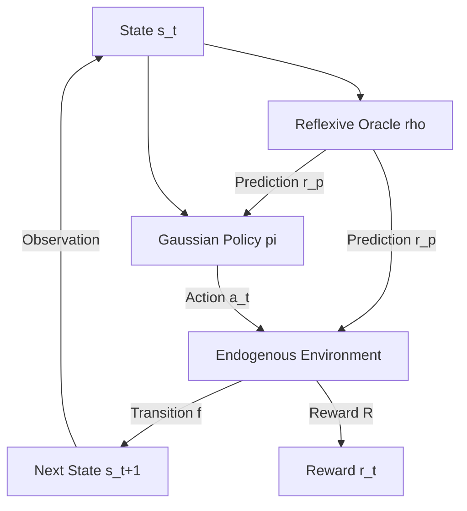

# ReflexiveRL

**A Research Framework for Endogenous and Reflexive Reinforcement Learning**

---

## Overview

ReflexiveRL is a research-oriented framework for studying **reinforcement learning in endogenous environments**, where predictive signals generated by the agent influence the system dynamics themselves. 

Unlike classical RL formulations that assume exogenous transition dynamics:
\[
s_{t+1} \sim P(s_{t+1} \mid s_t, a_t)
\]

ReflexiveRL models **prediction-dependent evolution**:
\[
s_{t+1} = f(s_t, a_t, \rho_\theta(s_t), \eta)
\]

where the predictive oracle ($\rho_\theta$) is part of the causal mechanism governing state transitions. This induces non-stationary effective dynamics, as the transition function depends on learned predictive components. Consequently, learning must account for the mutual dependence between prediction, policy, and environment dynamics. As a result, learning is no longer an optimization problem under fixed dynamics, but the stabilization of a coupled dynamical system.

---

## Research Motivation

Many real-world systems violate the passive prediction assumption of classical ML. In algorithmic markets, multi-agent coordination, and anticipatory control systems, the act of prediction itself alters the environment. ReflexiveRL provides a platform to study:

*   **Reflexive Instability**: Feedback loops where predictive signals amplify perturbations.
*   **Self-Fulfilling Prophecies**: Scenarios where the oracle's prediction $r_p$ drives the system toward that specific state.
*   **Oscillatory Dynamics**: Systems that fail to reach a fixed point due to predictive overreaction or lag.

---

## Core Concepts

### Reflexive Operator (Theoretical Foundation)

The system can be formalized as a coupled operator:
\[
\Phi(s) = T(s, \pi(\rho(s)))
\]

Learning corresponds to identifying approximate fixed points:
\[
s^* \approx \Phi(s^*)$
\]

In practice, the current implementation does not explicitly construct or iterate this operator. Instead, it minimizes surrogate objectives that reduce the fixed-point residual:
\[
\| s - \Phi(s) \| \approx \mathbb{E}[\| s_t - s_{t+1} \|]
\]

where the expectation is taken over the policy-induced action distribution. This provides a tractable approximation to operator-level consistency without requiring explicit Jacobian or contraction analysis.

### Endogenous Dynamics
Environment transitions explicitly depend on the predictive signal:
\[
s_{t+1} = f(s_t, a_t, r_p), \quad r_p = \rho_\theta(s_t)
\]

---

## Key Features

- **Prediction-Conditioned Transitions**
  Environment dynamics are explicitly modified by internal oracle outputs.
- **Joint Oracle–Policy Optimization**
  Predictive models ($\rho$) and policies ($\pi$) co-evolve within the same training block.
- **Stability-Aware Objectives**
  Loss functions incorporate penalties that regulate feedback-induced instability.
- **End-to-End Differentiability Across Dynamics**
  Gradients propagate through the differentiable components of the transition function $f$ using Zygote. In stochastic settings, this relies on reparameterization or policy gradient estimators, enabling learning signals to capture the sensitivity of future states to predictive signals through differentiable transition pathways.
- **Tiered Experimental Environments**
  Structured benchmarks to analyze reflexive effects across complexity regimes.

---

## System Architecture

The following diagram illustrates the endogenous feedback loop:



### Data Flow Pipeline
1.  **State Observation**: Agent observes $s_t$.
2.  **Oracle Prediction**: $\rho_\theta(s_t) \to r_p$.
3.  **Policy Generation**: $\pi_\phi( \cdot | [s_t, r_p] ) \to a_t$.
4.  **Endogenous Transition**: $s_{t+1} = f(s_t, a_t, r_p, \eta)$.
5.  **Refinement**: Gradients propagate through the full prediction-action-transition chain via Zygote.

---

## Algorithms Implemented

### Endogenous Gradient Projection (EGP)
- **Path**: `src/algorithms/egp.jl`
- **Objective**: $\mathcal{L} = -\mathbb{E}[R] + \beta_{stab} \cdot \mathbb{E}[(s_{t+1} - s_t)^2]$
- **Mechanism**: Encourages reward maximization while penalizing unstable transitions.
- **Note**: This implementation approximates endogenous gradients via stability-aware regularization rather than explicitly computing full reflexive gradient pathways ($\partial A/\partial r \cdot \partial r/\partial \theta$).

### Fixed-Point Reinforcement Learning (FPRL)
- **Path**: `src/algorithms/fprl.jl`
- **Objective**: $\mathcal{L} = \mathcal{L}_{PG} + \lambda_{fp} \cdot \mathbb{E}[(s_t - s_{t+1})^2]$
- **Mechanism**: Encourages convergence toward states with low fixed-point residual, which empirically correspond to locally stable configurations.
- **Note**: This does not explicitly enforce contraction properties; stability emerges from the optimization objective rather than being guaranteed.

### Iterative Consistency RL (ICRL)
- **Path**: `src/algorithms/icrl.jl`
- **Objective**: $\mathcal{L} = \mathcal{L}_{PG} + \beta \cdot \mathbb{E}[r_p^2]$
- **Mechanism**: Regularizes the magnitude of the oracle signal to prevent trivial or unstable feedback amplification.

### Implementation Distinction

Unlike standard RL:
- The transition function is effectively policy-dependent through the oracle, making the environment non-stationary with respect to the learning system.
- Gradients capture the sensitivity of future states to predictive signals through differentiable transition pathways.
- Optimization targets both reward and dynamical consistency.

---

## Repository Structure

```tree
.
├── src/
│   ├── ReflexiveRL.jl         # Main module
│   ├── algorithms/            # Agent implementations (EGP, FPRL, ICRL, SAC, PPO)
│   ├── core/                  # Interfaces and fundamental types
│   ├── environments/          # Benchmarks (Tier 1-3)
│   ├── models/                # Neural architectures (Flux)
│   └── training/              # Training engine (Trainer.jl)
├── scripts/                   # REPL-ready reproduction scripts
├── experiments/               # Result logs and LaTeX tables
├── test/                      # Gradient verification suite
└── Project.toml               # Dependency manifest
```

---

## Experimental Framework

### Benchmark Tiers
1.  **Tier 1 (Scalar Loops)**: Study convergence and fixed-point approximation in 1D space.
2.  **Tier 2 (Vector Stability)**: Analyze state-space bifurcations and multi-dimensional coupling ($\alpha$).
3.  **Tier 3 (Stochastic Chaos)**: Evaluate robustness in noisy, high-dimensional environments.

### Evaluation Metrics
- **Reward**: Standard cumulative return.
- **Reflexive Consistency**: $\mathbb{E}[\| s_t - s_{t+1} \|]$ (Fixed-point residual).
- **Feedback Sensitivity (Proxy)**: $\Delta s = f(s, a(r_p), r_p) - f(s, a(0), 0)$, measuring prediction influence with causal consistency.
- **Trajectory Variance**: Indicators of dynamical instability or oscillatory behavior.

### Representative Results
*(Full logs and benchmark tables available in `experiments/`)*

| Tier | Algorithm | Mean Reward | $I_{pred}$ (Var) |
| :--- | :--- | :--- | :--- |
| Tier 1 | EGP | -328.4 | 36.6 |
| Tier 2 | FPRL | -5.1 | 0.0 |
| Tier 3 | ICRL | -318.3 | 162.8 |

---

## Execution Flow

Scripts in `scripts/` initialize the environment and call `ReflexiveTrainer`. The trainer executes the rollout-update cycle defined in `src/training/trainer.jl`, where the oracle prediction is injected into the transition loop prior to algorithm-specific gradient updates.

---

## Reproducibility

- All experiments are seeded via Julia's `Random.seed!`.
- Deterministic behavior is ensured where possible, except for stochastic environment components.
- Scripts in `scripts/` correspond directly to reported experiments.
- Full logs and metrics are stored under `experiments/` for verification.

---

## Installation & Usage

```bash
git clone https://github.com/jitterx/ReflexiveRL.git
cd ReflexiveRL
julia --project -e 'using Pkg; Pkg.instantiate()'
```

### Reproduce Tier 1 EGP
```bash
julia --project scripts/reproduce_tier1_egp.jl
```

---

## Scope and Non-Goals

This framework is designed for controlled research experimentation and does not aim to:
- Provide production-ready reinforcement learning pipelines.
- Guarantee convergence or stability in all regimes.
- Fully implement operator-theoretic reflexive learning (current methods are approximations).

---

## Failure Modes

- **Oscillations**: High frequency switching when coupling ($\alpha$) exceeds stability thresholds.
- **Feedback Amplification**: Reinforcement of noise leading to divergence.
- **Differentiability Requirement**: Currently requires a differentiable environment transition function.

---

## Future Directions

- Explicit operator-based implementations of $\Phi(s)$ and Jacobian-based gradient pathways.
- Neural operator architectures (DeepONets) for high-dimensional state representations.
- Multi-agent reflexive equilibrium learning and Lyapunov-based stability constraints.
